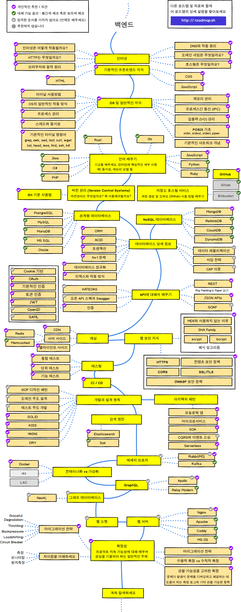

# AwesomeWebDevRoadmap
[웹개발 로드맵](roadmap.sh)에 따라 공부를 진행합니다.

## Roadnmap
### Frontend
* 
#### 학습 현황
* 인터넷
* HTML
* CSS
* JavaScript
* 버전 관리
* 웹 보안 지식
* 패키지 매니저
* CSS 구조
* CSS 전처리기
* 빌드도구
* 프레임워크 선택
* 현대의 CSS
* 웹 컴포넌트
* CSS 프레임워크
* 앱 테스트
* 타입 검사
* Progressive Web Apps
* 서버 사이드 렌더링
* GraphQL
* 정적 사이트 생성기
* 모바일 애플리케이션
* 웹 어셈블리
### Backend
* 
#### 학습현황
* 인터넷
* 기본적 프론트엔드 지식
* OS 및 일반적인 지식
* 언어 배우기
* 버전 관리 
* 관계형 데이터베이스
* 데이터베이스 상세 정보
* API에 대해서 배우기
* 캐싱
* 웹 보안 지식
* 테스팅
* CI/CD
* 개발과 설계 원칙
* 아키텍쳐
* 검색 엔진
* 메세지 브로커
* 가상화 vs 컨테이너화
* GraphQL
* 그래프 데이터베이스
* 웹 소켓
* 웹 서버
* 확장성
### DevOps
* 

#### 학습현황 
* 프로그래밍 언어 배우기
* 다양한 OS 개념 배우기
* 서버 관리 방법
* 운영 체제
* 터미널 활용 방법
* 네트워크, 보안 및 프로토콜
* ...의 정의와 설정 방법
  * 리버스 프록시
  * 포워드 프록시
  * 캐시 서버 
  * 로드 밸런서
  * 방화벽
* 웹서버
* Infrastructure as a Code
* CI/CD
* 소프트웨어와 인프라의 모니터링 방법
* 클라우드 제공업체
* 클라우드 디자인 패턴

